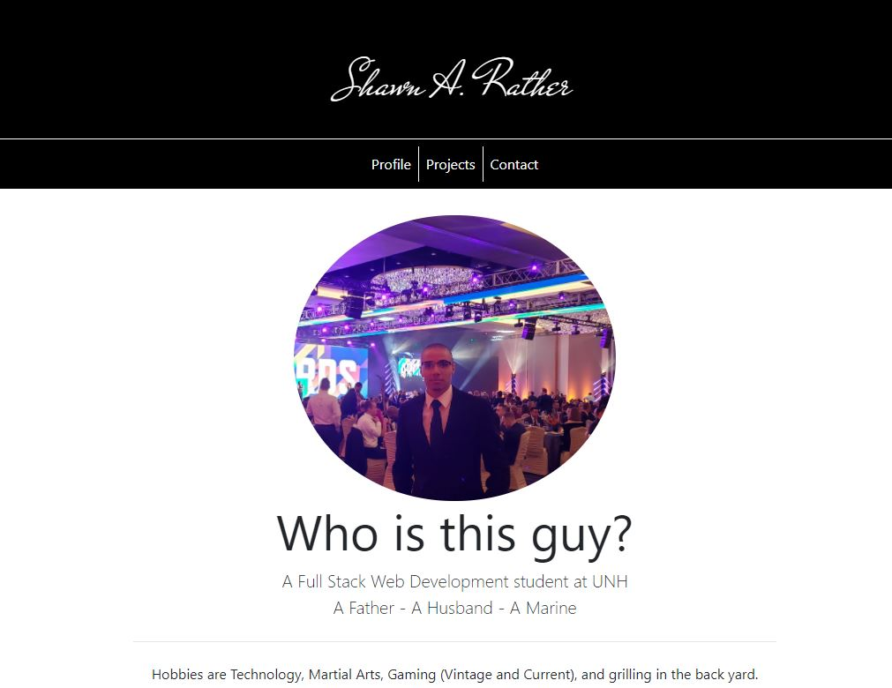
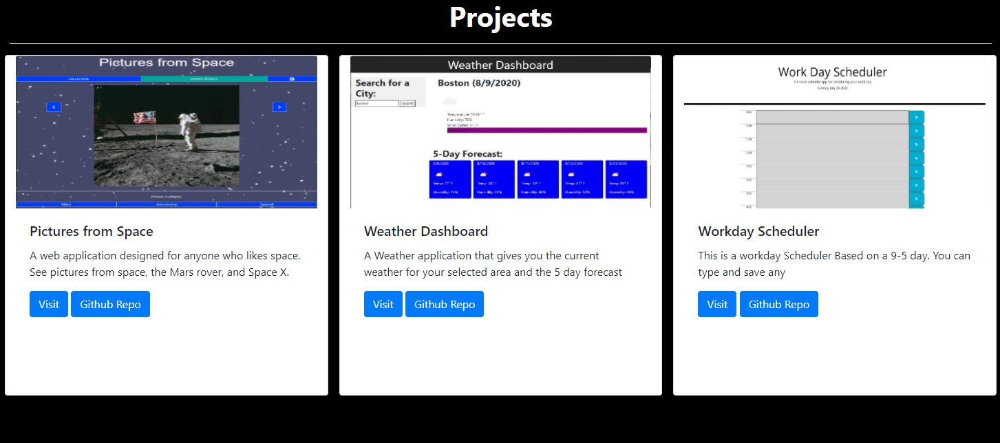

# Portfolio

## Table of Contents
- [Description](#descriptiongo)
- [Authors](#authorgo)
- [Questions](#contactgo)
        
## Description

This is my Portfolio. Letting you know a little about myself and what I'm working on.

## License

MIT License

## Authors

Shawn A. Rather

## Questions

Refer to github or send email with any questions:

https://github.com/SAR-SA

sarsa.web@gmail.com
